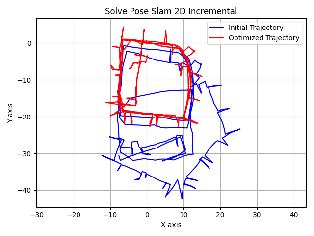
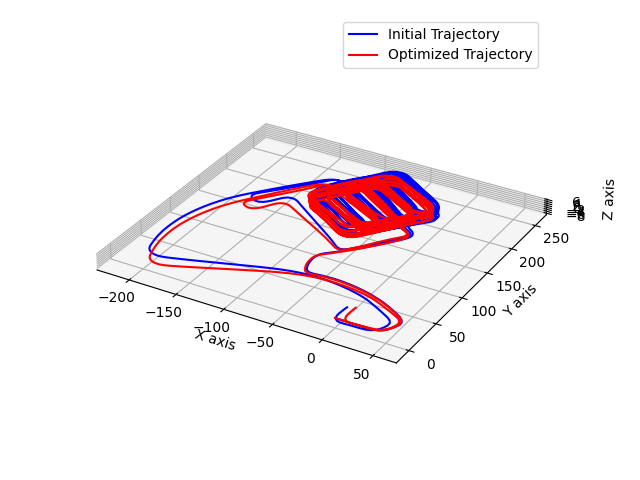
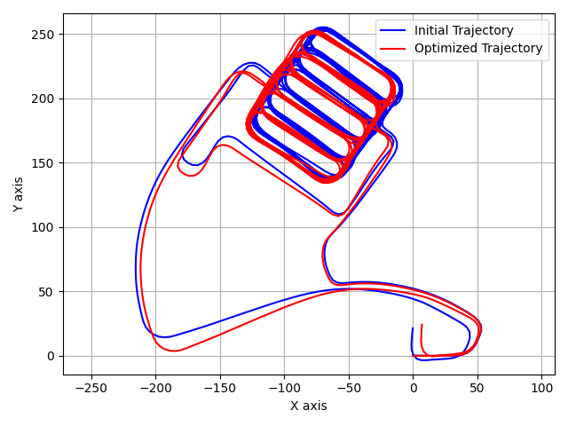

# GTSAM Pose SLAM Practice
This repo is a small pratice and example to solve the pose graph SLAM problem using the GTSAM library on INTEL and Garage dataset provied by [Dr. Luca Carlone](https://lucacarlone.mit.edu/datasets/). In cases below, both batch (Gauss-Newton) and incremental (iSAM) solutions are presented.

A detailed report can be found [here](docs/HW_SLAM.pdf).

## Quick Start
Run
```
python hw_slam.py # All optimized trajectory figures are saved under figures/
```


## 2D Pose SLAM
### Intel Lab Dataset


### Optimization Result


## 3D Pose SLAM
### Garage Dataset


### Optimization Result




## Dependencies
- Python 3.8 or above
- See [requirements.txt](requirements.txt)